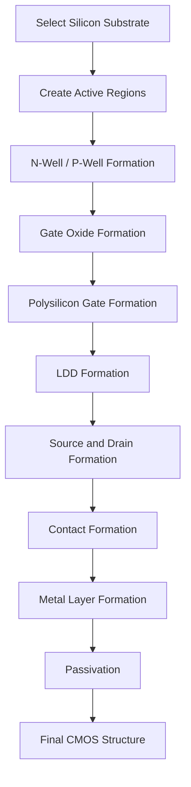
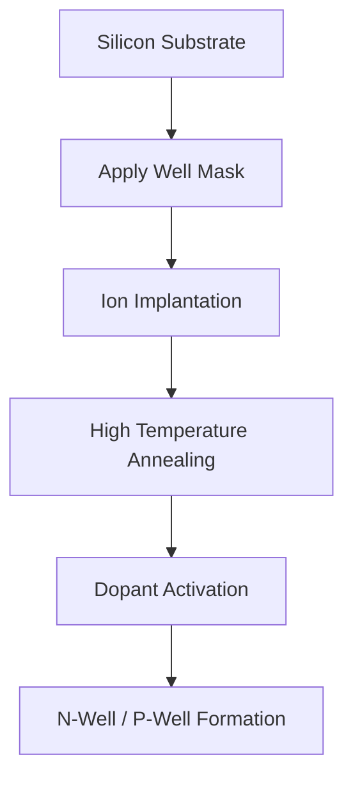
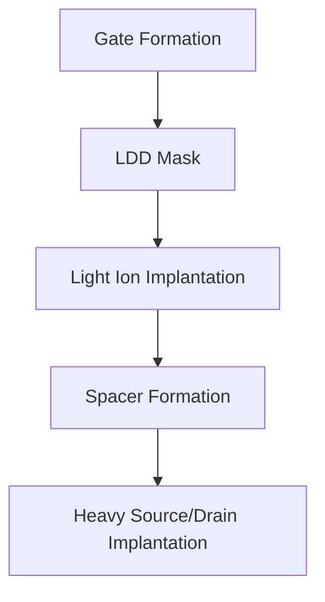
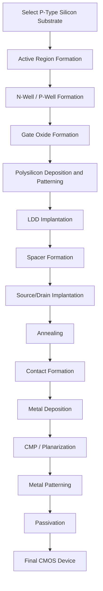
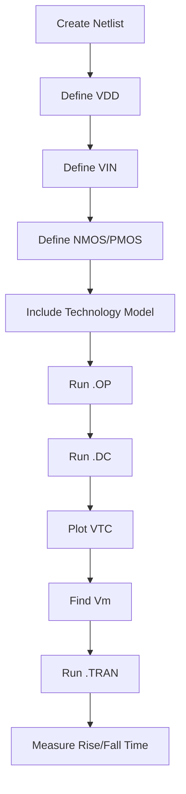
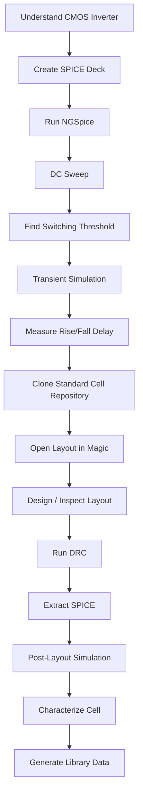

# Module 3: Design Library Cell Using Magic Layout and NGSpice Characterization

This module focuses on designing a **CMOS inverter library cell using Magic layout**, preparing its **SPICE deck**, and performing **NGSpice characterization and simulation**.

The module also covers the basic **CMOS fabrication process**, SPICE waveform analysis, switching threshold, static and dynamic simulation, and the steps required to obtain a layout-ready standard cell.

---

## Table of Contents

- [1. Module Overview](#1-module-overview)
- [2. Objectives](#2-objectives)
- [3. Tools Used](#3-tools-used)
- [4. CMOS Inverter](#4-cmos-inverter)
- [5. SPICE Deck](#5-spice-deck)
- [6. CMOS Inverter SPICE Netlist](#6-cmos-inverter-spice-netlist)
- [7. NGSpice Simulation Commands](#7-ngspice-simulation-commands)
- [8. Switching Threshold](#8-switching-threshold)
- [9. Transient Simulation](#9-transient-simulation)
- [10. Static and Dynamic Simulation](#10-static-and-dynamic-simulation)
- [11. Transistor Sizing](#11-transistor-sizing)
- [12. Rise Time and Fall Time](#12-rise-time-and-fall-time)
- [13. GitHub and VSD Standard Cell Repository](#13-github-and-vsd-standard-cell-repository)
- [14. Magic Layout](#14-magic-layout)
- [15. CMOS Fabrication Process](#15-cmos-fabrication-process)
- [16. Detailed CMOS Process Steps](#16-detailed-cmos-process-steps)
- [17. Formation of Contacts and Interconnects](#17-formation-of-contacts-and-interconnects)
- [18. Metal Layer Formation](#18-metal-layer-formation)
- [19. Overall Design Flow](#19-overall-design-flow)
- [20. Important Observations](#20-important-observations)
- [21. Conclusion](#21-conclusion)

---

# 1. Module Overview

The main objective of this module is to understand how a **CMOS inverter library cell** is designed, simulated, laid out, and characterized.

The complete flow involves:

1. Understanding the CMOS inverter.
2. Creating a SPICE deck.
3. Defining NMOS and PMOS devices.
4. Performing DC simulation.
5. Finding the switching threshold.
6. Performing transient simulation.
7. Measuring rise and fall delays.
8. Creating the layout using Magic.
9. Extracting the layout.
10. Simulating and characterizing the extracted cell.
11. Understanding the CMOS fabrication process.

---

# 2. Objectives

The major objectives of this module are:

- Understand the operation of a CMOS inverter.
- Understand SPICE deck creation.
- Identify component connectivity.
- Assign component values.
- Identify and name circuit nodes.
- Perform DC analysis using NGSpice.
- Determine the switching threshold voltage.
- Perform transient analysis.
- Study static and dynamic behavior.
- Understand transistor sizing.
- Study rise and fall delays.
- Create a CMOS layout using Magic.
- Understand layout-to-SPICE extraction.
- Understand the basic CMOS fabrication process.
- Understand the formation of contacts and interconnects.
- Characterize a standard-cell library.

---

# 3. Tools Used

| Tool | Purpose |
|---|---|
| **NGSpice** | SPICE circuit simulation and characterization |
| **Magic** | IC layout design and visualization |
| **GitHub** | Accessing and managing standard-cell design files |
| **SkyWater SKY130** | Open-source CMOS technology |
| **SPICE Models** | Modeling NMOS and PMOS transistor behavior |

---

# 4. CMOS Inverter

A CMOS inverter consists of:

- One PMOS transistor.
- One NMOS transistor.
- VDD supply.
- Input node.
- Output node.
- Ground connection.

The PMOS is connected between **VDD and OUT**, while the NMOS is connected between **OUT and GND**.

```text
                 VDD
                  |
                PMOS
                  |
                  +------ OUT
                  |
                NMOS
                  |
                 GND

                 |
                VIN
          connected to
       gates of PMOS/NMOS
```

### CMOS Inverter Operation

| VIN | PMOS | NMOS | VOUT |
|---|---|---|---|
| 0 | ON | OFF | 1 |
| 1 | OFF | ON | 0 |

Therefore:

```text
VIN = 0  →  VOUT = VDD
VIN = 1  →  VOUT = 0
```

---

# 5. SPICE Deck

A **SPICE deck** is a text description of a circuit that contains the information required by the simulator.

A SPICE deck generally contains:

- Component connectivity.
- Component values.
- Node names.
- Device models.
- Simulation commands.
- Supply definitions.
- Input definitions.
- End statement.

### Main Steps for Creating a SPICE Deck

```text
Component Connectivity
        ↓
Component Values
        ↓
Identify Nodes
        ↓
Name Nodes
        ↓
Define Models
        ↓
Define Sources
        ↓
Add Simulation Commands
        ↓
Run NGSpice
        ↓
Analyze Waveforms
```

---

# 6. CMOS Inverter SPICE Netlist

A basic CMOS inverter can be represented using the following SPICE structure:

```spice
* CMOS Inverter

* PMOS
M1 out in vdd vdd pmos W=0.375u L=0.25u

* NMOS
M2 out in 0 0 nmos W=0.375u L=0.25u

* Supply
Vdd vdd 0 2.5

* Input
Vin in 0 0

* DC Analysis
.dc Vin 0 2.5 0.05

* Technology Model
.include tsmc_025_um_model.mod

* End of netlist
.end
```

> **Note:** The exact model-file name and model syntax depend on the technology files being used. The values above represent the SPICE-deck example from the laboratory notes.

---

# 7. NGSpice Simulation Commands

## 7.1 Operating Point Analysis

The `.op` command is used to calculate the DC operating point of the circuit.

```spice
.op
```

It provides the operating conditions of the circuit at a specified bias point.

---

## 7.2 DC Sweep

The `.dc` command is used to sweep the input voltage over a specified range.

```spice
.dc Vin 0 2.5 0.05
```

### Meaning

```text
Vin  → Input voltage source
0    → Starting voltage
2.5  → Ending voltage
0.05 → Voltage step
```

This simulation is useful for obtaining the **Voltage Transfer Characteristic (VTC)** of the CMOS inverter.

---

# 8. Switching Threshold

The **switching threshold voltage**, usually represented by `Vm`, is the input voltage at which:

```text
VIN = VOUT
```

At this point, the CMOS inverter is transitioning between logic HIGH and logic LOW.

The switching point can be identified from the inverter's **Voltage Transfer Characteristic (VTC)**.

```text
VOUT
  |
  |\
  | \
  |  \
  |   \
  |    \
  |     \
  |      \
  |       \________
  |
  +-------------------- VIN
             ↑
            Vm
       VIN = VOUT
```

### Importance of Switching Threshold

The switching threshold is important because it determines:

- Logic transition point.
- Noise margin.
- Symmetry of the inverter.
- Digital circuit reliability.
- Voltage transfer behavior.

---

# 9. Transient Simulation

Transient analysis studies the variation of voltage and current with respect to time.

A pulse input can be applied to the inverter to observe its dynamic response.

Example:

```spice
Vin in 0 PULSE(0 2.5 0 1n 1n 10n 20n)
```

The transient simulation can be performed using:

```spice
.tran 0.1n 100n
```

The resulting waveform shows:

- Input transition.
- Output transition.
- Rise time.
- Fall time.
- Propagation delay.

---

# 10. Static and Dynamic Simulation

## Static Simulation

Static simulation studies the circuit for steady-state input conditions.

Examples:

```text
VIN = 0
VIN = VDD
```

The output should settle to the corresponding logic state.

```text
VIN = 0 → VOUT ≈ VDD

VIN = VDD → VOUT ≈ 0
```

---

## Dynamic Simulation

Dynamic simulation studies the response of the circuit when the input changes with time.

```text
Input Pulse
     ↓
PMOS/NMOS Switching
     ↓
Output Transition
     ↓
Measure Delay
     ↓
Measure Rise/Fall Time
```

---

# 11. Transistor Sizing

The switching behavior of a CMOS inverter depends on the relative sizing of the NMOS and PMOS transistors.

The important parameters are:

- `Wn` = NMOS width
- `Wp` = PMOS width
- `Ln` = NMOS channel length
- `Lp` = PMOS channel length

The transistor strength is related to:

```text
W/L
```

where:

```text
W = Transistor width
L = Channel length
```

The laboratory notes use an example with approximately:

```text
Wn = 0.375 µm
Wp = 0.375 µm

Ln = 0.25 µm
Lp = 0.25 µm
```

Therefore:

```text
Wn/Ln = 0.375/0.25 = 1.5

Wp/Lp = 0.375/0.25 = 1.5
```

Thus:

```text
Wn/Ln ≈ Wp/Lp ≈ 1.5
```

---

# 12. Rise Time and Fall Time

When the input of a CMOS inverter changes, the output does not change instantaneously.

Two important parameters are:

### Rise Time

Time taken by the output to transition from LOW to HIGH.

```text
LOW → HIGH
```

### Fall Time

Time taken by the output to transition from HIGH to LOW.

```text
HIGH → LOW
```

The notes include example delay observations for different transistor sizing conditions.

| Relative Sizing | Observation |
|---|---|
| `Wp/Lp = X` | Reference condition |
| `Wp/Lp ≈ Wn/Ln` | Balanced inverter behavior |
| `Wp/Lp ≈ 2(Wn/Ln)` | Modified transition behavior |
| `Wp/Lp ≈ 3(Wn/Ln)` | Rise/fall characteristics change |
| `Wp/Lp ≈ 4(Wn/Ln)` | Further sizing effect |
| `Wp/Lp ≈ 5(Wn/Ln)` | Strong PMOS sizing effect |

Changing the PMOS-to-NMOS strength changes the switching point and the rise/fall characteristics.

---

# 13. GitHub and VSD Standard Cell Repository

The laboratory work uses an open-source standard-cell design environment.

The repository can be cloned using Git:

```bash
git clone https://github.com/nickson-jose/vsdstdcelldesign.git
```

Move into the repository:

```bash
cd vsdstdcelldesign
```

The design can then be opened using Magic with the appropriate SKY130 technology file.

Example:

```bash
magic -T sky130A.tech sky130_inv.mag
```

The exact technology file name may vary depending on the installed SKY130 setup.

---

# 14. Magic Layout

**Magic** is an open-source VLSI layout tool used to create and inspect integrated-circuit layouts.

The CMOS inverter layout contains:

- NMOS region.
- PMOS region.
- Polysilicon gate.
- Source.
- Drain.
- Metal interconnections.
- Contacts.
- Well/substrate regions.

### Basic Layout Concept

```text
                 VDD
                  |
             PMOS Source
                  |
               PMOS
                  |
                  +------ OUT
                  |
               NMOS
                  |
             NMOS Source
                  |
                 GND

             POLY = VIN
```

The same input gate controls both the PMOS and NMOS.

---

# 15. CMOS Fabrication Process

The CMOS fabrication process involves a sequence of steps used to create NMOS and PMOS transistors and their interconnections on a silicon substrate.

A simplified CMOS process flow is:



---

# 16. Detailed CMOS Process Steps

## 16.1 Selecting a Substrate

The first step is selecting a suitable silicon substrate.

The notes specify:

- P-type substrate.
- High resistivity silicon.
- Approximately `(100)` crystal orientation.
- Suitable doping concentration.

The substrate doping should be controlled so that the required transistor characteristics can be obtained.

---

## 16.2 Creating the Active Region

The active region is defined using masking and photolithography.

A simplified sequence is:

```text
Silicon Substrate
       ↓
SiO₂ Layer
       ↓
Si₃N₄ Layer
       ↓
Photoresist
       ↓
Masking
       ↓
Development
       ↓
Etching
       ↓
Active Region
```

The notes mention:

- Approximately `40 nm SiO₂`.
- Approximately `80 nm Si₃N₄`.
- Photoresist deposition.
- Masking.
- Development.
- Etching.
- Resist removal.
- Oxidation furnace.

---

## 16.3 LOCOS Oxidation

The process of forming a thick field oxide using selective oxidation is known as:

**LOCOS — Local Oxidation of Silicon**

The process is used to electrically isolate active device regions.

After the required oxidation:

```text
Si₃N₄ is stripped
        ↓
Field oxide remains
        ↓
Active regions are isolated
```

Hot phosphoric acid can be used for removing the silicon nitride layer.

---

# 17. N-Well and P-Well Formation

Well formation is used to create the required regions for NMOS and PMOS transistors.

The process includes:

- Ion implantation.
- High-temperature annealing.
- Dopant activation.

Typical dopants mentioned in the notes include:

```text
Boron      → P-type doping
Phosphorus → N-type doping
```

Example process flow:



---

# 18. Gate Formation

Gate formation is one of the important CMOS fabrication steps.

The process includes:

1. Gate oxide formation.
2. Oxide cleaning/etching.
3. Growth of high-quality thin oxide.
4. Polysilicon deposition.
5. Polysilicon patterning.
6. Gate implantation where required.

### Gate Oxide

The gate oxide provides the dielectric layer between the gate and the semiconductor.

A thin, high-quality oxide is required for proper transistor operation.

---

## 18.1 Gate Oxide Formation

The oxide is grown using controlled oxidation.

The original oxide may be removed and regrown to obtain the required oxide quality and thickness.

---

## 18.2 Polysilicon Deposition

A polysilicon layer is deposited over the wafer.

The polysilicon layer is then patterned using a suitable mask.

```text
Oxide
  ↓
Polysilicon Deposition
  ↓
Photoresist
  ↓
Mask
  ↓
Patterning
  ↓
Polysilicon Gate
```

---

# 19. Lightly Doped Drain (LDD) Formation

LDD stands for:

**Lightly Doped Drain**

LDD formation is used to reduce the electric field near the drain and improve device reliability.

Two important reasons mentioned in the notes are:

1. **Hot electron effect**
2. **Short-channel effect**

The electric field can be approximated as:

```text
E = V / d
```

A high electric field can provide sufficient energy for carriers to cause undesirable effects.

The notes also mention an approximate barrier between the silicon conduction band and silicon dioxide conduction band.

---

## LDD Process



---

# 20. Source and Drain Formation

Source and drain regions are formed using ion implantation.

The process includes:

- Source/drain mask.
- Dopant implantation.
- Annealing.
- Activation of implanted dopants.

The source/drain regions provide the terminals required for current flow through the transistor.

```text
             Gate
              |
        ┌─────┴─────┐
        │ Polysilicon│
        └─────┬─────┘
              |
   Source     |      Drain
      ↓       |        ↓
   ┌──────────┴──────────┐
   │      Silicon        │
   └─────────────────────┘
```

---

# 21. Contact Formation

After source/drain formation, contacts are created to connect the transistor terminals to the metal layers.

The notes describe:

- Etching the oxide using an HF solution.
- Titanium deposition.
- Sputtering.
- Annealing.
- Formation of low-resistance contact material.

Titanium nitride (`TiN`) is used as a contact-related material in the process.

---

## RCA Cleaning

RCA cleaning is used to clean the wafer surface before subsequent processing.

The notes mention a cleaning solution consisting of:

```text
De-ionized water (H₂O) → 5 parts
Ammonium hydroxide (NH₄OH) → 1 part
Hydrogen peroxide (H₂O₂) → 1 part
```

This cleaning step helps remove contaminants from the wafer surface.

---

# 22. Higher-Level Metal Formation

A higher-level metal layer is deposited for routing and interconnection.

The notes mention:

- SiO₂ deposition.
- Phosphorus/Boron doping where applicable.
- Planarization.
- Metal deposition.
- Patterning.

Chemical Mechanical Polishing (**CMP**) is used for planarizing the wafer surface.

---

# 23. Chemical Mechanical Polishing

**CMP — Chemical Mechanical Polishing**

CMP is used to obtain a planar wafer surface.

It combines:

- Chemical action.
- Mechanical polishing.

The process removes excess material and creates a flat surface for subsequent processing.

```text
Uneven Surface
      ↓
Chemical + Mechanical Action
      ↓
Material Removal
      ↓
Planar Surface
```

---

# 24. Final Metal and Passivation

The final stages include:

- Formation of upper metal layers.
- Contact opening.
- Interconnection.
- Passivation.

A dielectric layer such as silicon nitride can be used to protect the chip.

The final contact-opening step exposes the required contact locations.

---

# 25. CMOS Fabrication Flow

The complete simplified CMOS fabrication sequence can be represented as:



---

# 26. CMOS Inverter Characterization Flow

The complete characterization process can be summarized as:

```mermaid
flowchart LR
    A[CMOS Inverter Design]
    --> B[Create SPICE Deck]
    --> C[Define NMOS and PMOS Models]
    --> D[DC Sweep]
    --> E[Obtain VTC]
    --> F[Find Switching Threshold]
    --> G[Transient Simulation]
    --> H[Measure Rise/Fall Delay]
    --> I[Create Magic Layout]
    --> J[Extract Layout]
    --> K[Post-Layout Simulation]
    --> L[Cell Characterization]
```



---

# 27. SPICE Simulation Flow



---

# 28. Magic Layout to Simulation Flow


---

# 29. Library Cell Design Flow

A standard-cell library cell goes through multiple stages before it can be used in a digital design.

```text
          CMOS Circuit
               ↓
         SPICE Simulation
               ↓
        Transistor Sizing
               ↓
         Magic Layout
               ↓
       Design Rule Check
               ↓
       Parasitic Extraction
               ↓
        Post-Layout SPICE
               ↓
       Timing Characterization
               ↓
        Library Cell (.lib)
               ↓
       Digital ASIC Flow
```

---

# 30. Important SPICE Parameters

| Parameter | Meaning |
|---|---|
| `W` | Transistor width |
| `L` | Channel length |
| `VDD` | Supply voltage |
| `VIN` | Input voltage |
| `VOUT` | Output voltage |
| `Vm` | Switching threshold |
| `.op` | Operating-point analysis |
| `.dc` | DC sweep analysis |
| `.tran` | Transient analysis |
| `.include` | Include model/library file |
| `.end` | End of SPICE deck |

---
# Results:


# 31. Important Observations

### Observation 1: Switching Threshold

The switching threshold is obtained from the point where:

```text
VIN = VOUT
```

The switching point depends on the relative strength of the NMOS and PMOS devices.

---

### Observation 2: Transistor Sizing

Changing the transistor width changes the transistor drive strength.

```text
Larger W
   ↓
Larger W/L
   ↓
Higher Drive Strength
   ↓
Different Switching and Delay Characteristics
```

---

### Observation 3: Rise and Fall Delay

The rise and fall delays are affected by:

- PMOS sizing.
- NMOS sizing.
- Load capacitance.
- Supply voltage.
- Input transition time.
- Parasitic capacitance and resistance.

---

### Observation 4: Layout Parasitics

A schematic simulation does not contain all physical parasitic effects.

After layout extraction:

```text
Layout
  ↓
Parasitic Extraction
  ↓
Additional R and C
  ↓
Post-Layout Simulation
  ↓
More Realistic Delay
```

---

# 32. Difference Between Pre-Layout and Post-Layout Simulation

| Feature | Pre-Layout | Post-Layout |
|---|---|---|
| Circuit | Schematic | Extracted layout |
| Parasitics | Usually minimal | Included |
| Accuracy | Idealized | More realistic |
| Delay | Lower/idealized | Can increase |
| Purpose | Functional verification | Physical/timing verification |

---

# 33. Why Layout Is Important

The layout converts the transistor-level circuit into a physical representation.

A correct layout must satisfy:

- Connectivity requirements.
- Design rules.
- Device dimensions.
- Well requirements.
- Contact requirements.
- Metal routing requirements.
- Spacing requirements.

The layout is therefore an essential step between circuit design and physical fabrication.

---

# 34. Overall Module Flow



---

# 35. Key Takeaways

- A CMOS inverter consists of one PMOS and one NMOS transistor.
- The PMOS connects the output to VDD, while the NMOS connects the output to ground.
- A SPICE deck describes the circuit, models, sources, and simulation commands.
- `.op` performs operating-point analysis.
- `.dc` performs DC sweep analysis.
- `.tran` performs transient analysis.
- The switching threshold is obtained from the VTC where `VIN = VOUT`.
- Transistor sizing affects switching threshold, drive strength, rise time, and fall time.
- Magic is used for physical IC layout.
- Layout extraction allows post-layout SPICE simulation.
- CMOS fabrication includes well formation, gate formation, LDD, source/drain formation, contacts, metal layers, CMP, and passivation.
- CMP is used to planarize the wafer surface.
- Proper contacts and interconnects are required to connect the fabricated devices.
- Standard-cell characterization connects transistor-level design with digital ASIC implementation.

---

# 36. Conclusion

This module provides an end-to-end understanding of **CMOS library-cell design and characterization**. The flow starts with the CMOS inverter schematic and SPICE simulation, followed by switching-threshold and timing analysis. The design is then represented physically using Magic layout, extracted for parasitic effects, and simulated again using NGSpice.

The module also introduces the major CMOS fabrication steps, including substrate selection, well formation, gate formation, LDD formation, source/drain formation, contact formation, metallization, CMP, and passivation.

Overall, the flow can be summarized as:

```text
Circuit Design
      ↓
SPICE Simulation
      ↓
Transistor Sizing
      ↓
Magic Layout
      ↓
DRC
      ↓
Extraction
      ↓
Post-Layout Simulation
      ↓
Characterization
      ↓
Standard Cell
```
